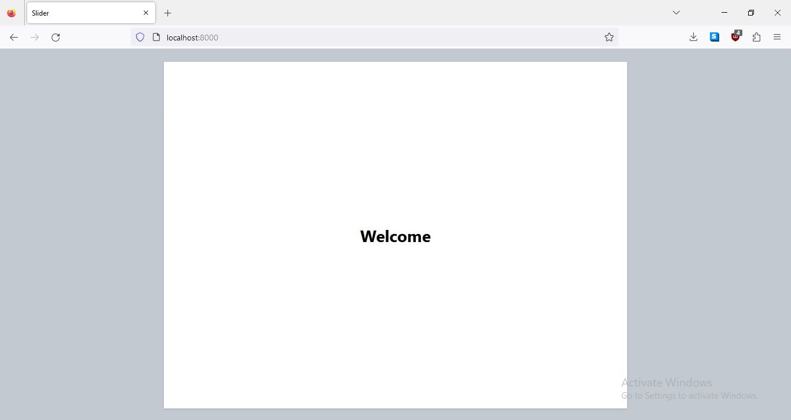

# SliderJS
Javascript library for slide-shows.

## What is this ?
This is a javascript library for slideshows. With this you can crush your presentations with all the capabilities of html5 and javascript.     
Prepare your slideshow presentations in .slides format. and pass that to `SliderJS` class as a url or a file. and you are good to go.

## How to use it ?
1. Include SliderJS library in the html page.
```html
<link type="text/css" href="https://cdn.jsdelivr.net/gh/ppml38/slider/dist/slider.css" rel="stylesheet"/>
<script src="https://cdn.jsdelivr.net/gh/ppml38/slider/dist/slider.js"></script>
```
2. Create an instance of Slider and present that in page.
```js
let slider = new Slider();

document.getElementById("root")
	.appendChild(
			slider.presentURL("slideshow.json") // use "presentFile" for local slides.
		); 

document.onkeydown = (event)=>{
	let e=event||window.event;
	if (e.key == 'ArrowLeft') {
		slider.previous();
	}
	else if (e.key == 'ArrowRight') {
		slider.next();
	}
};
```

## Slideshow file structure:
Slide show needs to be in `.slides` file.    
In this file, all the slides along with the segments of each slide will be in json format.    

You can refer a sample slideshow file `demo_slideshow.slides`.    

Sample `.slides` file format:
```json
{
	...
	"slides":[
		{
			...
			"segments":[
				{
					...
				}
				...
			]
		},
		...
	]
}
```

## Demo
[Click here](https://ppml38.github.io/slider/demo/index.html) for a quick demo.

### Screenshot
